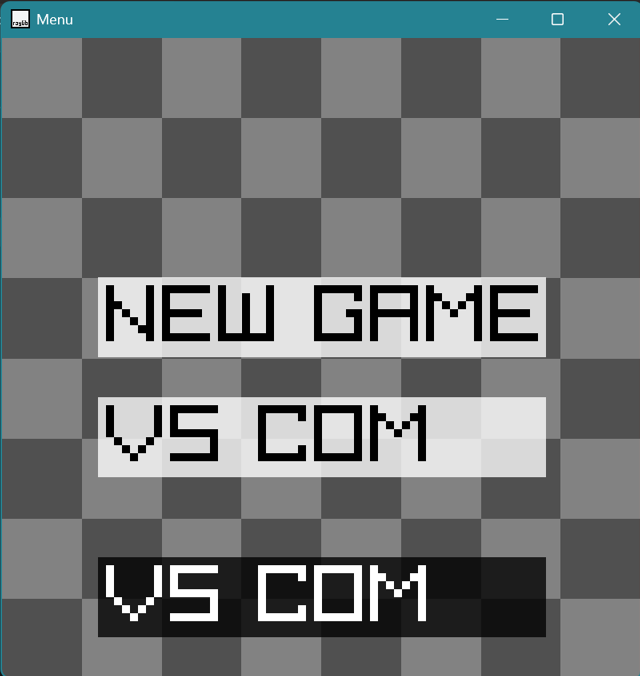
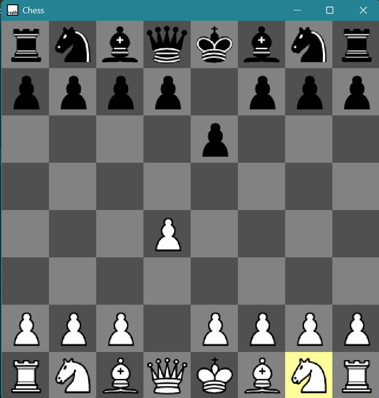
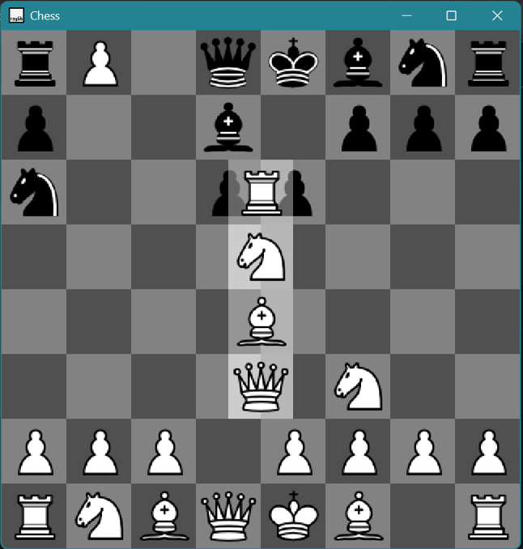
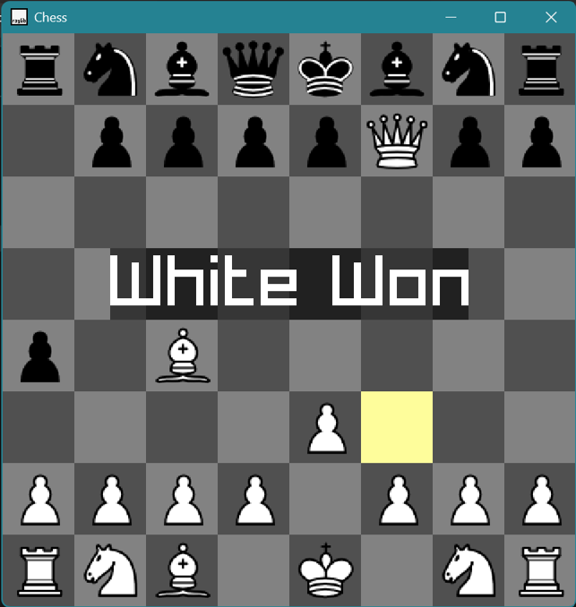

# Chess Game in C++ using Raylib & Stockfish

A fully functional desktop chess game built in C++ using the Raylib graphics library, with Stockfish engine integration for AI opponent gameplay.
(Download the exe from releases to play)

---

## Preview
1. Menu: 
<p align="center">
  
</p>

2. In Game: 
<p align="center">
  
</p>

3. Pawn Promotion: 
<p align="center">
  
</p>

4. Game Over: 
<p align="center">
  
</p>

---

## Features

- 1 Two-player Pass & Play mode
- 2 Play as White or Black against Stockfish AI
- 3 Full chess rule implementation:
  - Legal move validation for all pieces
  - Check & Checkmate detection
  - Stalemate detection
  - Castling (Kingside & Queenside) for both colors
  - En Passant
  - Pawn Promotion with piece selection UI
- 4 Highlighted selected piece tile
- 5 Game log saved to `gamelog.txt` in UCI notation
- 6 Main menu to select game mode
- 7 Game over screen with result display

---

## Built With

- **C++** — Core game logic
- **[Raylib](https://www.raylib.com/)** — Window, rendering, input handling
- **[Stockfish](https://stockfishchess.org/)** — AI chess engine (communicates via Windows pipes)
- **Windows API** — Process creation and pipe-based IPC with Stockfish

---


## How It Works

### Game State Machine
The game runs on a state machine with the following states:
```
SELECT_PIECE → SELECT_DESTINATION → (PAWN_PROMOTION) → SELECT_PIECE
                                  ↘ GAME_OVER
```

### Stockfish Integration
Stockfish runs as a **child process** and communicates via **Windows named pipes**:
1. Game sends `position startpos moves <movelist>` to Stockfish
2. Game sends `go movetime 50` to request best move
3. Stockfish responds with `bestmove <move>`
4. Game parses and applies the move to the board

### Move Validation
- All piece movement rules are validated in `Board::validateNewPosition`
- After every move, `checkForCheck` scans all attack vectors from the king's position
- Checkmate and stalemate are verified by attempting all possible moves for the side

---

## Getting Started

### Prerequisites
- Windows OS
- [Visual Studio](https://visualstudio.microsoft.com/) or any C++ compiler with Raylib configured
- Raylib library linked (`raylib.lib`)

### Build & Run

1. **Clone the repository**
```bash
git clone https://github.com/yourusername/chess-cpp-raylib.git
cd chess-cpp-raylib
```

2. **Set up Raylib**
   - Download Raylib from [raylib.com](https://www.raylib.com/)
   - Link `raylib.lib` in your project settings

3. **Place Stockfish engine**
   - Download Stockfish from [stockfishchess.org](https://stockfishchess.org/download/)
   - Place the `.exe` inside the `engine/` folder

4. **Build and run**
   - Open in Visual Studio, build in Release or Debug mode
   - Run `raylib-quickstart-main.exe`

---

## Controls

| Action | Input |
|---|---|
| Select piece | Left Mouse Click |
| Move piece | Left Mouse Click on destination |
| Select promotion piece | Left Mouse Click on promotion UI |
| Return to menu (Game Over) | Spacebar |

---

## Game Log

Every game is logged to `gamelog.txt` in **UCI notation**:
```
e2e4 e7e5 g1f3 b8c6 f1b5 ...
Computer Move: d8h4
```

---

## Known Limitations

- Windows only (uses Win32 API for Stockfish IPC)
- Stockfish path must be inside `engine/` folder next to the executable
- No draw by repetition or 50-move rule implemented
- No game timer

---

## Contributing

Pull requests are welcome. For major changes, please open an issue first to discuss what you would like to change.

---

## License

This project is open source and available under the [MIT License](LICENSE).

---

## Acknowledgements

- [Raylib](https://www.raylib.com/) by Ramon Santamaria — amazing simple graphics library
- [Stockfish](https://stockfishchess.org/) — the world's strongest open source chess engine
- Chess piece assets from [Wikimedia Commons](https://commons.wikimedia.org/wiki/Category:SVG_chess_pieces)
